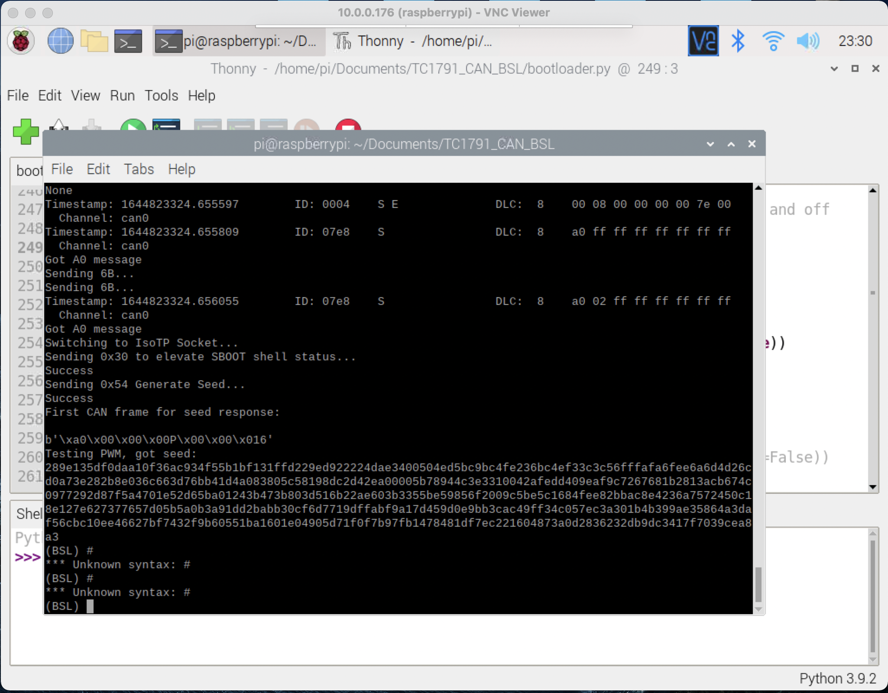
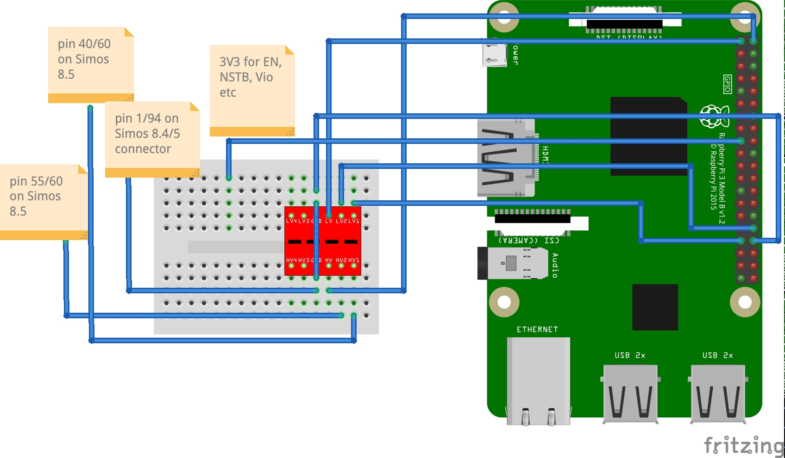

# TC1796_CAN_BSL
This has been inspired by `bri3d`'s CAN Bootstrap Loader (BSL) repo (https://github.com/bri3d/TC1791_CAN_BSL) for Tricore AudoMAX (TC1791 and friends) and started itself as its fork. It has been revamped/rewritten to work with TC1796 (Tricore AudoNG).
~~[Info/work on Simos 8.4/8.5 (TC1796)](Simos8_sboot_connections.md) is currently in progress~~ ~~A **milestone** (passing seed-key challenge) has been reached~~ 
It is now possible to extract the boot passwords in semi-automated fashion (by flipping some switches over and over again :lol),
and read and write the data to and from the Simos 8.5 ECU:tada: :tada: :tada:

It took a while to partially reproduce the original Simos 18 exploit due to "unbound grounds" issue - i.e, ECU ground and Raspberry Pi grounds (!!!)need to be connected in order for GPIO to produces the correct PWM shapes to ge the ECU into the service mode:


Below is a TC1791/TC1796 CAN BSL info from the original Github repo as it pertains to Simos 18 and 8 ECUs.
# Background
By setting the HWCFG register on Tricore processors to a specific value, the Mask ROM / Boot ROM in the CPU will enter a serial-based or CAN-based Bootstrap Loader.

On AudoMAX, this Bootstrap Loader copies bytes to the beginning of Scratchpad RAM (C0000000 for Simos18 or D0004000 for Simos 8.x) and jumps directly to execution from SPRAM.

Unfortunately, when the BSL is invoked, flash memory is locked by the Tricore user passwords. A mechanism for extracting these passwords exists for various ECUs, including Simos 8 and 18, and a partial implementation for Simos 8.5 is described here. 
In tandem with `twister` tool available at https://github.com/fastboatster/Simos8_SBOOT, a complete open-source "bench" toolset has also been made available for Simos8.5.

# Internal Pins and PCB modifications

* To open the ECU is very easy. It's held together with a few bent metal tabs and black RTV sealant. Simply bend the metal tabs away and cut through the black RTV sealant and the cover will lift right off. To reinstall is just the opposite.
* The preferred method is to use "pogo pin" connectors/BDM frame to connect to the contact points on the ECU PCB, but soldering might be OK
* If you already have boot passwords, simply using the BSL is not timing critical, you can just ground one of the HWCFG pins and supply 3V3 to another, respectively (see PCB connection point diagram photo). 
* If you do not, and you need to recover the passwords, you will also need to attach CPU RST pin to RPi GPIO pin #23.
* You'll also need to supply 3V3 voltage to some of the connection points on the ECU PCB to get ECU CAN transmitter into active mode, otherwise no CAN bus communication with ECU will happen when it's in BSL mode

# Recommend bill of materials:

* 12-14V bench power supply. I usually supply 13.6V.
* Raspberry Pi 2, 3, or 4 (RPi 4 was used).
* RPi breadboard.
* Seeeed Studios 2517/2518FD CAN Hat was originally recommended, however it couldn't be procured due to limited availability. Instead, Waveshare 2-channel CAN FD Hat was used (https://www.waveshare.com/2-ch-can-fd-hat.htm) The original doc states that 2515 CAN hats are not capable of reliably completing a read process, but may be useful for brick recovery.
* 20+ various lengths of wire. A breadboard wire kit will be good.
* A bunch of resistors - 1K were used but higher values may work as well.
* High speed (3.2khz capable) 3.3V to 5V level shifters. 2 level shifters are required - most cheap "I2C converter" boards on Amazon, eBay, Aliexpress will work. 
* Soldering equipment OR a "BDM frame" and probes. These test points and vias are very easy to solder with a steady hand, but if you do not wish to solder, a "BDM frame" and probes as found on Aliexpress or Amazon will also work.
* A mechanism for connecting to pins on the ECU connector. I used breadboard wire kit wires to connect to some smaller ECU connector pins (CAN, PWM, smaller +12V pins) and blade-style connectors to connect to larger +12V and ground pins. Alligator clips might work here as well.

# Hardware Setup

Make connections according to the diagrams below:
## Simos 8.5


## Simos 8.4
Due to some requests, posting this untested (for now) PCB layout for Simos 8.4, as it can be seen it can be connected similar to Simos 8.5.
I.e., STB-N needs to be connected to 3V3 via 1kOhm resistor just like NSTB in Simos 8.5, and P10.1 and P10.0 need to
be grounded and connected to 3v3 via 1kOhm, respectively, to get TC1796 into CAN Bootloader mode.


# Harness Pins

Connect the following pins of the ECU harness connector: 
## Simos 8.4 connections to Raspberry Pi:
Only used to test if the seed is returned, no attempt to extract the passwords yet.
- Connector with 94 contacts:
- 68 CAN Hi
- 67 CAN Lo
- 64 +12V
- 87 +12V
- 2 - ground from the power supply
- 1 - ground from Raspberry Pi (pin 34, although any ground should work. pin 34
 is also used as level converter's ground)
- Connector with 60 contacts:
- 25 - pin 32 Raspberry Pi (GPIO 12 (PWM0))
- 11 - pin 33 Raspberry Pi (GPIO 13 (PWM1))
 Note: all Raspberry Pi pin numbers are from pinout.xyz

## Simos 8.5 connections to Raspberry Pi:
Nearly identical to 8.4 except for PWM pins:
- Connector with 94 contacts:
 - 68 CAN Hi
 - 67 CAN Lo
 - 64 +12V
 - 87 +12V
 - 2 - ground from the power supply
 - 1 - ground from Raspberry Pi (pin 34, although any ground should work. pin 34
 is also used as level converter's ground)
- Connector with 60 contacts:
 - 55 - pin 32 Raspberry Pi (GPIO 12 (PWM0))
 - 40 - pin 33 Raspberry Pi (GPIO 13 (PWM1))

# Setup for Password Extraction

* `Simos8_SBOOT` should get cloned along with this repo as its one of its git submodules. Just compile `twister.c`, might require installing some `.deb` packages
* `crchack` is also a git submodule so just compile it per instructions.
* P.S. `twister.c` will need to be modified to include Simos 8.4 RSA key and to also take ECU type (8.4 vs 8.5) as an argument
This is on TODO list for this project

# "Bench reading" a Simos8 ECU:

* Perform the above steps to configure the ECU for BSL mode. Ensure you have `./Simos8_SBOOT/twister` and `./crchack/crchack` compiled.
* Make sure to make all the appropriate connections to the PCB and the ECU connector
* Ensure `pigpiod` is running: `sudo pigpiod`
* Ensure `can1` (or `can0`, depends on your CAN FD hat setup) is up at bitrate `500000` and with the `txqueuelen` increased: `sudo ip link set can1 up type can bitrate 500000 && sudo ifconfig can1 txqueuelen 65536`
* Start `python3 bootloader.py` and run the following commands:

```
$ python3 bootloader.py 
Welcome to Tricore BSL. Type help or ? to list commands, you are likely looking for upload to start.

(BSL) extract_boot_passwords_simos8
[... , device will start 4 times to find 4 CRC values, should take ~2 minutes]
CRC32 Current Value: 
0xf427254f
80014218 - 0x80014318 -> 0xf427254f
abf425508513c27314e31d3542b92b1b # These are the boot passwords. The first 8 bytes are the Read passwords and the second 8 bytes are the Write passwords.
(BSL) send_read_passwords abf42550 8513c273 # <<< These passwords are the first 8 bytes from the previous line. 
(BSL) uncompressed_read_simos8 a0000000 001FFFFF full_read_simos85.bin
```

The password extraction part is still fiddly, and extracting all 4 boot passwords at once might not work. This will be explained later in the later git commit.

# Recovering a bricked Simos8.5 ECU:

* You can erase the Calibration area, which will force the ECU into CBOOT.
```
$ python3 bootloader.py 
Welcome to Tricore BSL. Type help or ? to list commands, you are likely looking for upload to start.

(BSL) extract_boot_passwords
[... , device will start 4 times to find 4 CRC values, should take ~2 minutes]
CRC32 Current Value: 
0xf427254f
80014218 - 0x80014318 -> 0xf427254f
abf425508513c27314e31d3542b92b1b # These are the boot passwords. The first 8 bytes are the Read passwords and the second 8 bytes are the Write passwords.
(BSL) send_read_passwords abf42550 8513c273 # <<< These passwords are the first 8 bytes from the previous line. 
(BSL) send_write_passwords 14e31d35 42b92b1b
(BSL) erase_cal_simos8 
(BSL) reset
```
Now use `ODIS` etc to reflash the ECU from CBOOT with whatever software you wanted. 

* Or you can erase and overwrite bad sectors/flash part using commands such as `erase_cboot_simos8`, `erase_asw_simos8`, `erase_cal_simos8`. Then write appropriate flash part using `write_file_simos8` command.
An example of writing an ASW section:
```
write_file_simos8 A0080000 00180000 full_read_simos85.bin 00080000
```
See `help write_file_simos8` for param info.


# Current tools:

* [bootloader.py](bootloader.py) : This tool uploads "bootloader.bin" into an ECU in Bootstrap Loader mode.
* [bootloader](https://github.com/fastboatster/TC1796_CAN_bootloader) : This repo contains a project intended for us with the HiTec Tricore Free Toolchain (GCC) which will produce a bootstrap loader binary containing some basic command primitives. Based on Infineon(R) AP32136 application note ~~It uses the basic TriBoard TC1791 iRAM linker presets from HiTec, with the DRAM memory map adjusted to not clobber the boot-time device id stored at D0000000 to D000000C. CANBus primitives were generated using DaVe V2.~~
