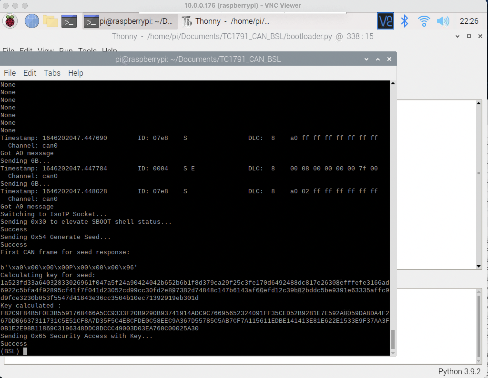
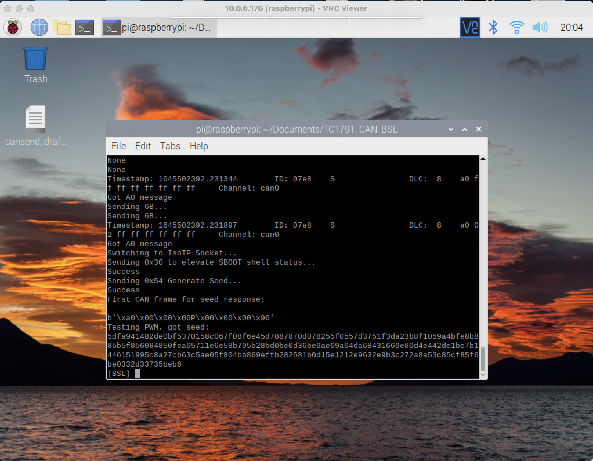

# Simos 8.4/8.5 Raspberry Pi connections for SBOOT Shell Exploit Seed Response Testing
## Update
Using `sboot` command and `twister` from https://github.com/fastboatster/Simos18_SBOOT, seed-key challenge was **finally** 
passed after updating `SEED_START` value in `bootloader.py`. This value sets the iteration start for seed evaluation process.

 Note that current version of `bootloader.py` works intermittently and sometimes the response to `6B` message is missed.
This, however, can be caused by other hardware factors.
```commandline
Calculating key for seed: 
1a523fd33a64032833026961f047a5f24a90424042b652b6b1f8d379ca29f25c3fe170d6492488dc817e26308efffefe3166ad6922c5bfa4f92895cf41f7f041d23052cd99cc30fd2e897382d74848c147b6143af60efd12c39b82bddc5be9391e63335affc9d9fce3230b053f5547d41843e36cc3504b10ec71392919eb301d
Key calculated: 
F82C9F84B5F0E3B5591768466A5CC9333F20B9290B93741914ADC9C76695652324091FF35CED52B9281E7E592A8059DA8DA4F267DD06637311731C5E51CF8A7D35F5C4E8CFDE0C58EEC9A367D55785C5AB7CF7A115611EDBE141413E81E622E1533E9F37AA3F0B1E2E98B11869C3196348DDC8DCCC49003D03EA760C00025A30
Sending 0x65 Security Access with Key...
Success
```

## Simos 8.4 connections to Raspberry Pi:
Only used to test if the seed is returned, no attempt to extract the passwords.
- Connector with 94 contacts:
- 68 CAN Hi
- 67 CAN Lo
- 64 +12V
- 87 +12V
- 2 - ground from the power supply
- 1 - ground from Raspberry Pi (pin 34, although any ground should work. pin 34
 is also used as level converter's ground)
- Connector with 60 contacts:
- 25 - pin 32 Raspberry Pi (GPIO 12 (PWM0))
- 11 - pin 33 Raspberry Pi (GPIO 13 (PWM1))
 Note: all Raspberry Pi pin numbers are from pinout.xyz


## Simos 8.5 connections to Raspberry Pi:
Nearly identical to 8.4 except for PWM pins:
- Connector with 94 contacts:
 - 68 CAN Hi
 - 67 CAN Lo
 - 64 +12V
 - 87 +12V
 - 2 - ground from the power supply
 - 1 - ground from Raspberry Pi (pin 34, although any ground should work. pin 34
 is also used as level converter's ground)
- Connector with 60 contacts:
 - 55 - pin 32 Raspberry Pi (GPIO 12 (PWM0))
 - 40 - pin 33 Raspberry Pi (GPIO 13 (PWM1))


 Example Simos 8.5 256 byte seed:
 ```
 5dfa941482de0bf5370158c067f08f6e45d7887870d078255f0557d3751f3da23b8f1059a4bfe8b885b5f856084850fea65711e6e58b795b28bd0be0d36be9ae69a04da68431669e80d4e442de1be7b1446151995c8a27cb63c5ae05f804bb869effb282581b0d15e1212e9632e9b3c272a8a53c85cf85f6be0332d33735beb6
 ```

Obtained using `test_pwm` command in `bootloader.py` by quickly hitting `Enter` when prompted to turn on the ECU power and then turning the ECU power very quickly after that.